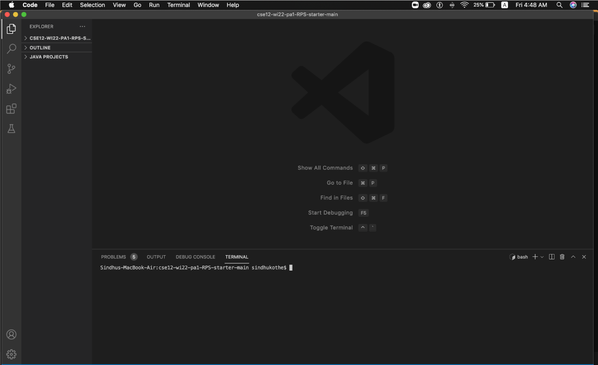
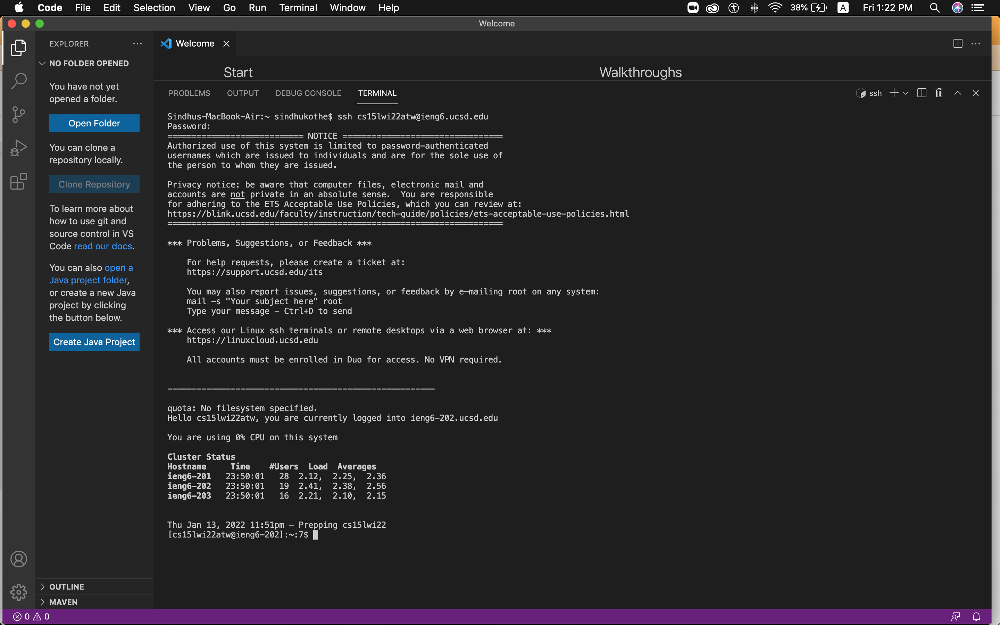
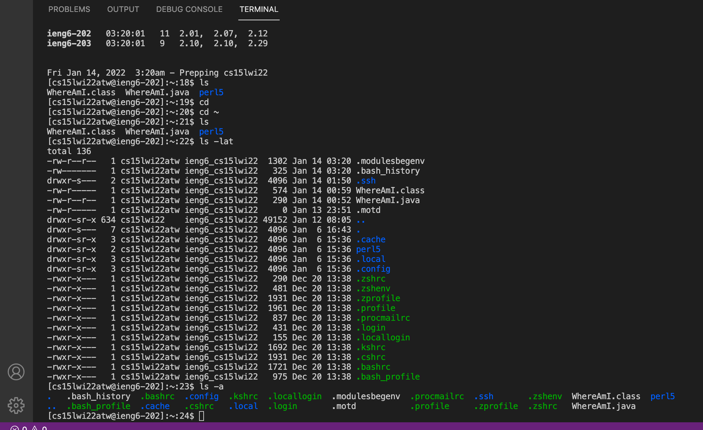
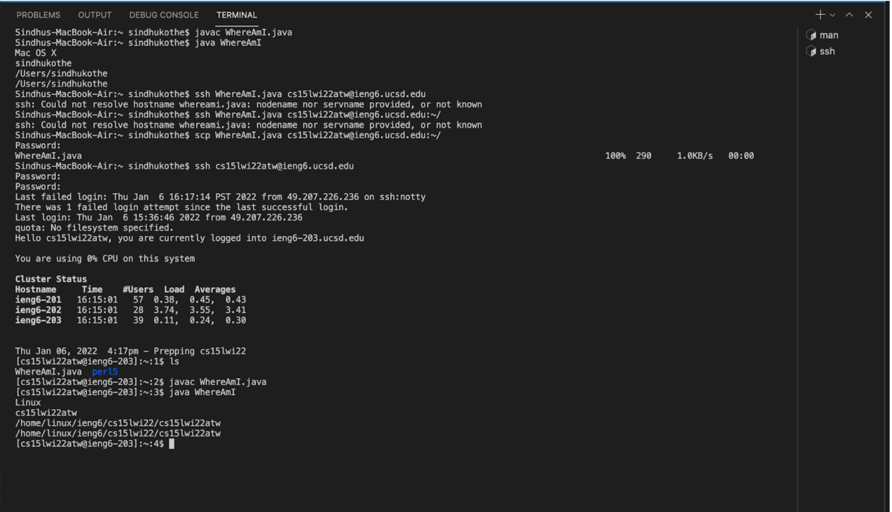
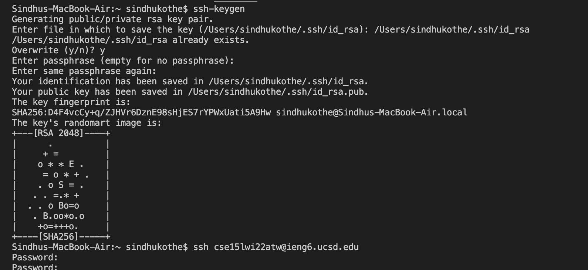
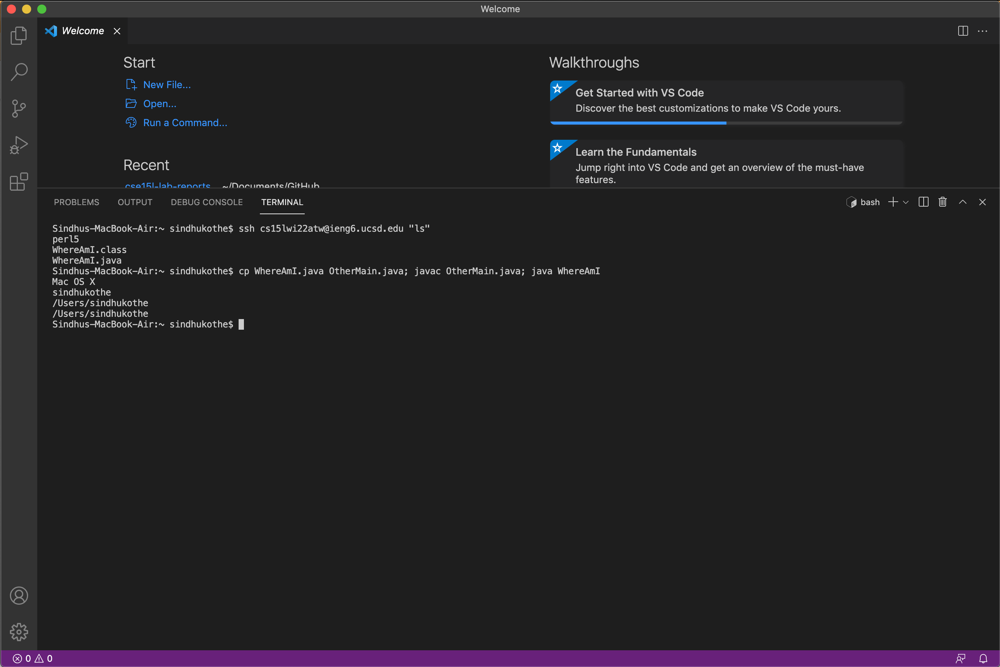

# Lab Report 1


Some of the information on this page is referenced from the class website. 


## Installing VSCode. 


* To install VSCode, go to this [link](https://code.visualstudio.com/)

* Also, download Java. A version after Java 14 is preffered. 

* VSCode could be used to edit Java files and GitHub pages, like this one. 



## Remoteley Connecting


* I am using a Mac so I do not need to install OpenSSH but if you are using a Windows laptop, go to this [link](https://docs.microsoft.com/en-us/windows-server/administration/openssh/openssh_install_firstuse)

* Now, look up your [course-specific account ](https://sdacs.ucsd.edu/~icc/index.php) for the course. You might have to change your password. My course specific account is cse15lwi22atw@ieng6.ucsd.edu

* Now, open a new terminal (Terminal -> New Terminal), and type the following code: 
```
$ ssh cs15lwi22zz@ieng6.ucsd.edu
```



## Trying Some Commands

* Different commands show different aspects of the file that is being run. 

* These are what some of the commands do:
    * cd ~ : change to home directory. 
    * cd: change directory
    * ls: lists all the files in current directory
        * ls - l: all the info about the file, long listed
        * ls-a: shows all the hidden files starting with .
        * ls-lt: lists all the files and when you last edited them in order of when they were last edited
    * pwd: **p**resent **w**orking **d**irectory




## Moving some files with scp


* The command to copy files from one computer to a remote computer is called scp. 

* In the screenshot, we see that the variables that print out the locations of the file change. The first time, it prints out the details of my laptop. The second time, the details of the server are shown. 




## Setting an SSH key 

* The command that was used was 
```
 ssh-keygen
```
this command generates a public key and a private key. The private key will be stored on one location in the client while the public key will be stored in one location on the server. The ssh command sets up a communication between these two keys. 

* The commands to copy the public key onto the account on the server is as show. (This was taken from the class website):

```
$ ssh cs15lwi22zz@ieng6.ucsd.edu
<Enter Password>
# now on server
$ mkdir .ssh
$ <logout>
# back on client
$ scp /Users/joe/.ssh/id_rsa.pub cs15lwi22@ieng6.ucsd.edu:~/.ssh/authorized_keys
# You use your username and the path you saw in the command above
```




## Optimizing remote running


* You can run multiple commands using the ;
```
$ cp WhereAmI.java OtherMain.java; javac OtherMain.java; java WhereAmI
```

* If you run a command in quotes, the command will run on the remote server and exit. 
```
$ ssh cs15lwi22@ieng6.ucsd.edu "ls"
```

* When I am rerunning the code, it takes a total of 6 keystrokes. However, it would take more than that on the first try as I would have to type in the command prompts. 


