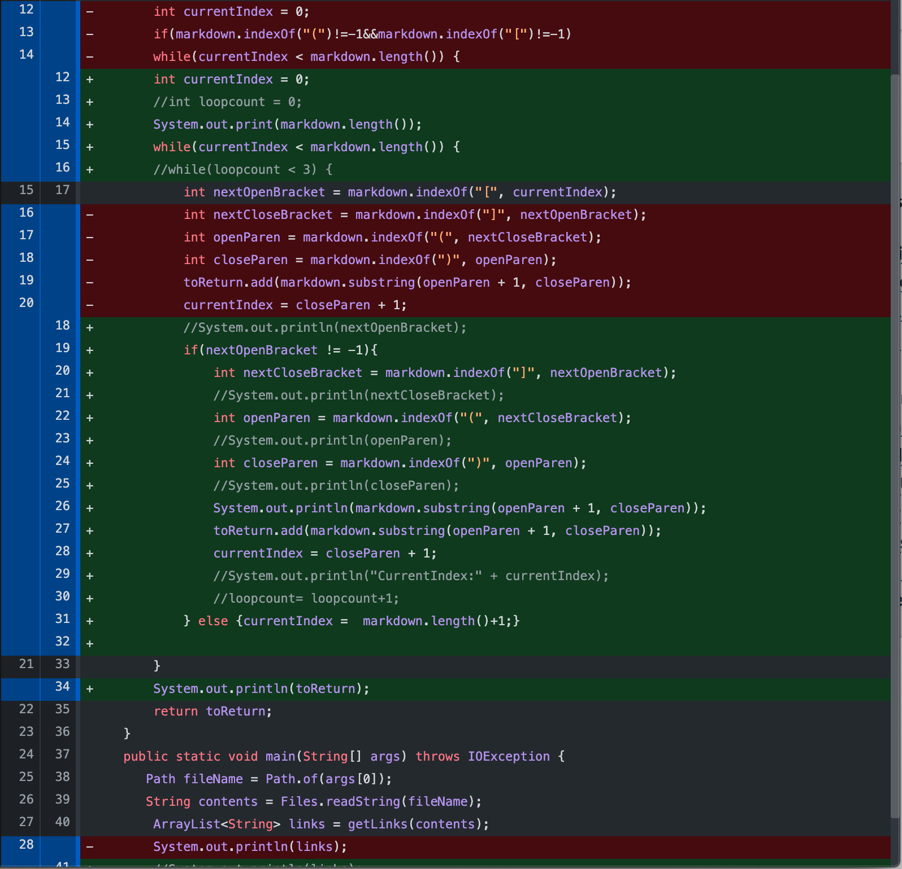
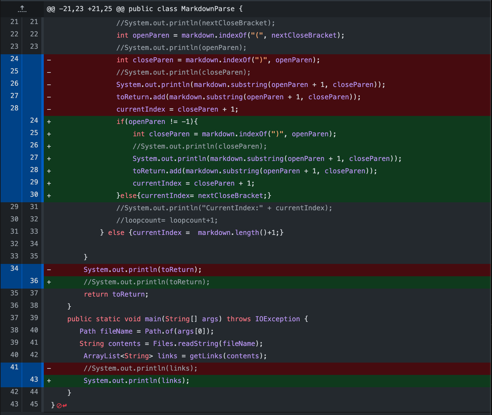
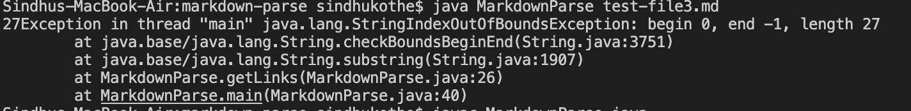
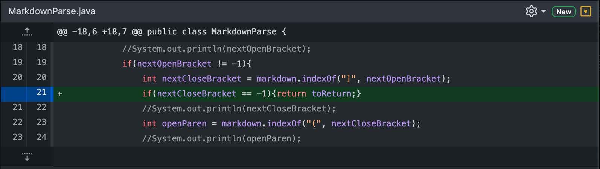
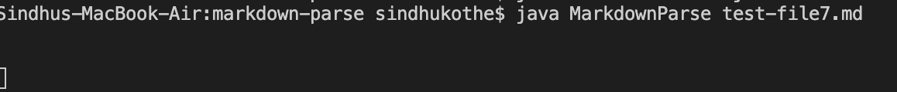

# Lab Report 2

## Change 1

This is the [link](https://github.com/ucsd-cse15l-w22/markdown-parse) to the file that made me make the change: 

* The test for the code failed when I ran it with file2 as the file that the contents are supposed to be read from. This was because the loop was an infinite loop. 

* To fix the problem, I added an of statement

## Change 2

This is the [link](https://github.com/ucsd-cse15l-w22/markdown-parse/blob/main/test-file3.md) to the file that made me make the change: 

This is the screenshot of the command line when I ran the command:

* The test for the code failed when I ran it with file3 as the file that the contents are supposed to be read from. This was because there was no ( character so the variable openParen was -1. 

* As a result, the next line of code could not compile

* I fixed this problem using an if statement

## Change 3

This is the [link](https://github.com/ucsd-cse15l-w22/markdown-parse/blob/main/test-file7.md) to the file that made me make the change: 

This is the screenshot of the command line when I ran the command:

* The test for the code failed when I ran it with file3 as the file that the contents are supposed to be read from. This was because the ( character came after the ] character. 

* As a result, the program went into an infinite loop

* I fixed this problem using an if statement

