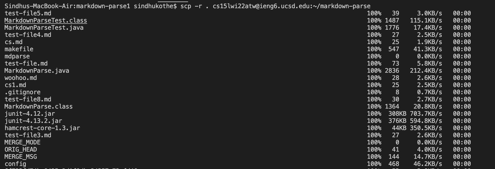
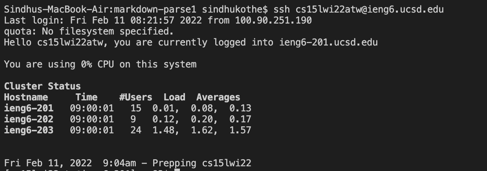
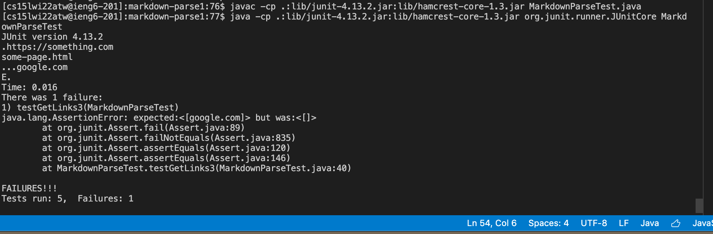
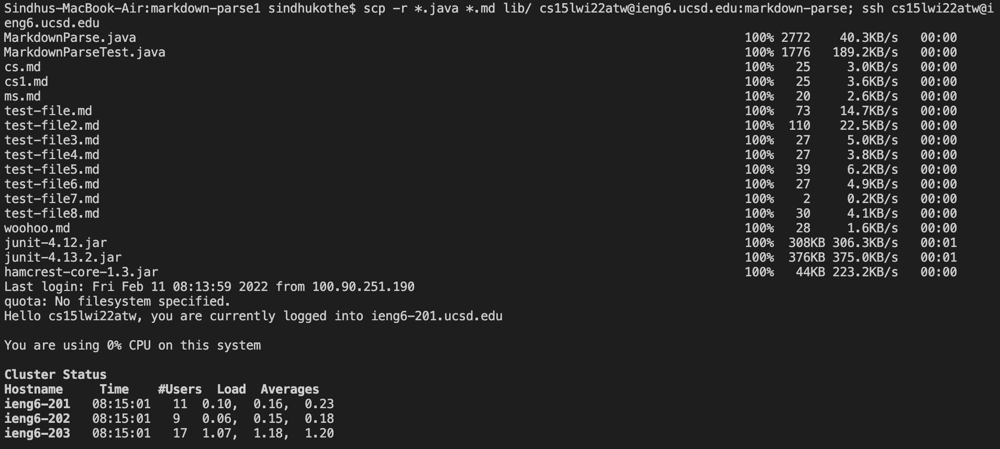
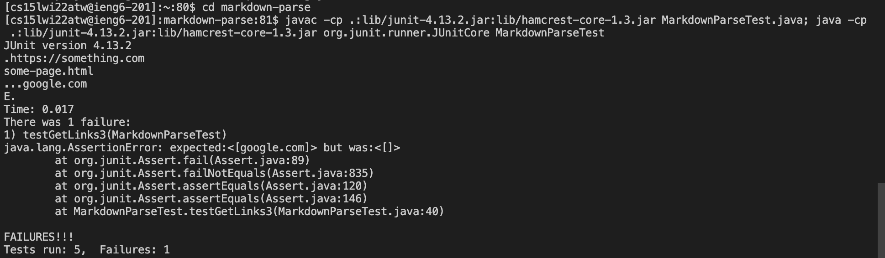
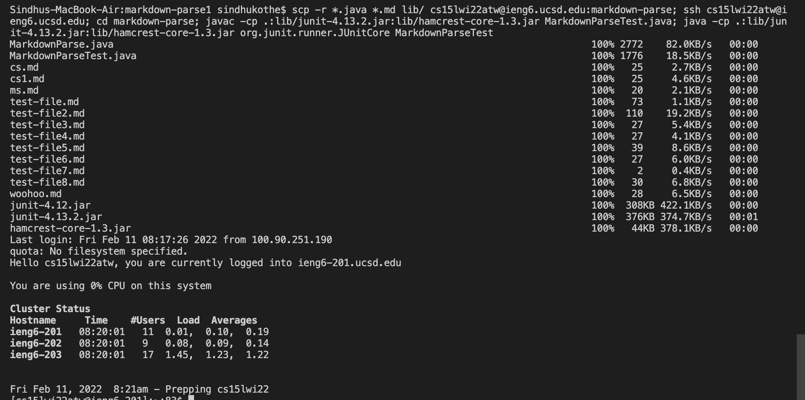

# Lab Report 3

## Copying whole directories with scp -r

Copying the whole markdown-parse directory into the ieng6 account.

 
Logging into the ieng6 account. 

Running the tests

Using semicolons to run multiple commands

