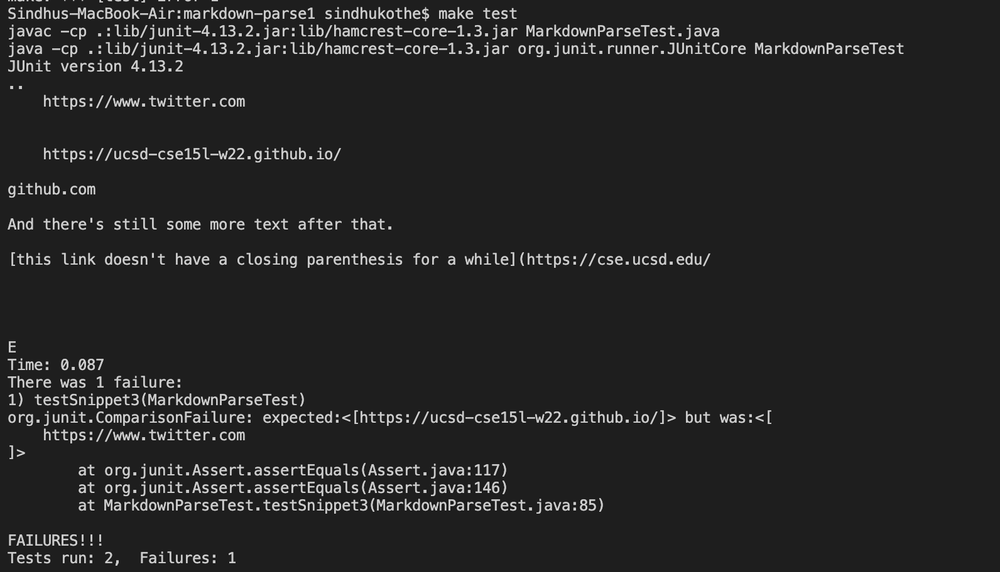

# Lab Report 4

The link of the repository that I reviewed: https://github.com/Darrengn/markdown-parse

## Snippet 1

### My code
The test failed: 

Code changes: I did not account for backticks in my implemntation of the code. This is is why the first link was counted. To fix this, I need to add a couple of if statements that would be scattered accross the code. 

### The code that I reviewed
The test failed: 

Code changes. even they did not account for backticks. Like I said above, it would take around 10 lines for them to include code that takes backticks into account. 

## Snippet 2

### My code
The test failed: 

Code changes: I did not account for an empty open and close parenthesis in the code. This would also need a couple of if statements that are scattered accoross the code. However, I am not sure if it could be done in less than 10 lines. This is because we need to make a distinction between the parenthsis that are used to indicate the start of a link and those that are do not contain any information in them. 

### The code that I reviewed
The test failed: 

Code changes: 
They aso had the same problem with their code. They did not account for an empty open and close parenthesis. Like i mentioned before, I am not sure if it could be done in less than 10 lines

## Snippet 3

### My code
The test failed: 

Code changes: I did not account for an new lines after the links. This would take a coupole of if statents to fix. This is because you need to account for multiple situations. Some of these include having a new line in the middle of the link, having a new line in between the end of the link and the parenthesis, having a new line between the start of the link and the parenthesis. Because there are so many possibilities, the code would span for more than 10 lines. 

### The code that I reviewed
The test failed: 

Code changes: their code had the same porblem as ours. They did not account for new lines. For the reasons mentioned above, it would take more than 10 lines to fix this problem. 
