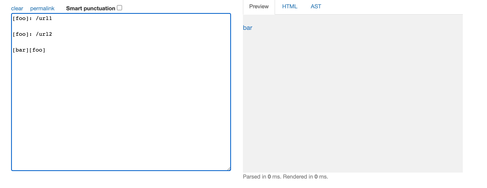
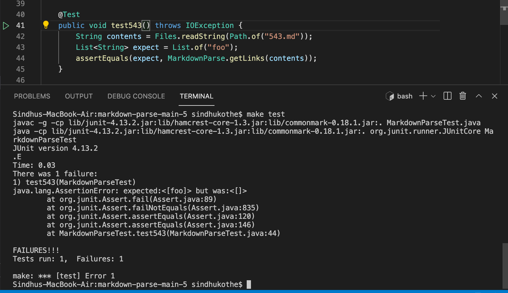
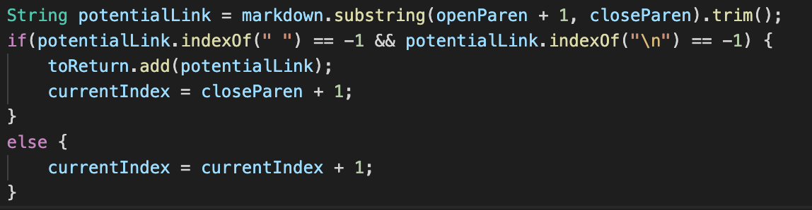
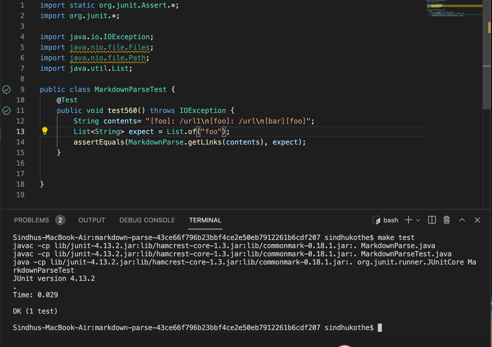
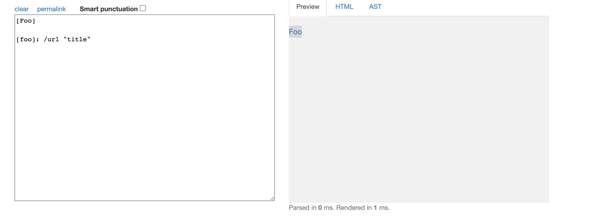
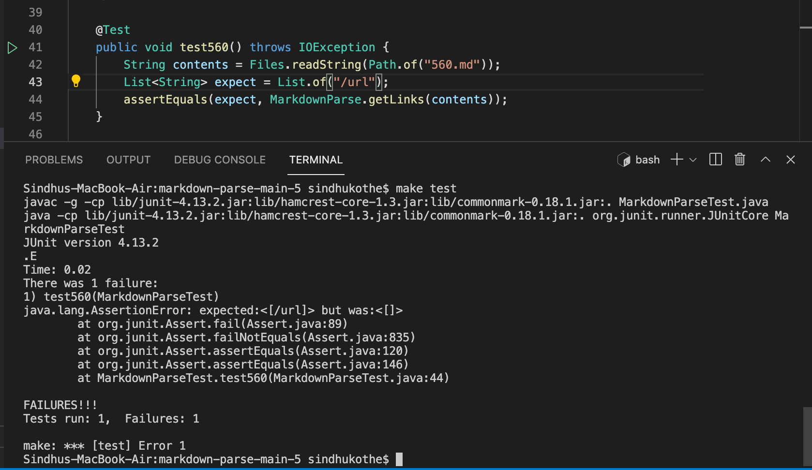
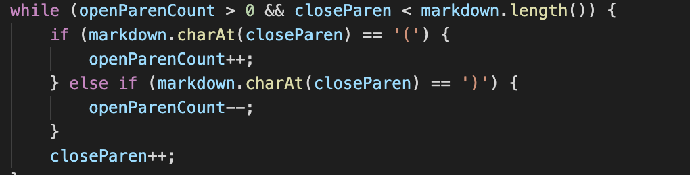
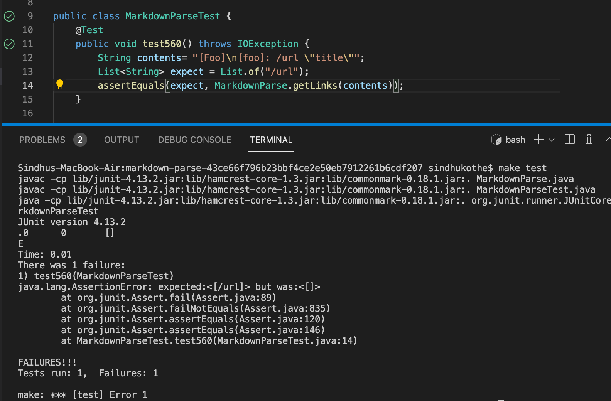
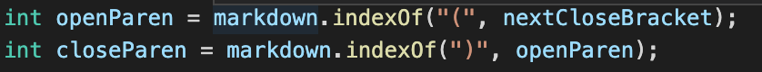

# Lab Report 5

The expected output that I have decided on is determined throught the [CommonMark website](https://spec.commonmark.org/dingus/)

# How I found the tests:
I manually searched through the tests. The tests that I found were 560.md and 543.md

# Test 1: 543.md
Expected result: [foo]

## Output from the provided code:

This implementation is incorrect. I think this was because the program was not traversing through multiple lines correctly. I also think that the part that caused the error was this:

## Output from my code

The implementation is correct. (Also the screenshot says test560 but I was actually testing 543. I forgot to change the name)

# Test 2: 560.md
Expected result: [/url]

## Output from the provided code

This implemetation is not correct. This is because in this test, the link does not start with an open bracket. The  snippet that should be changed is this:

## Output from my code

 This implementation of the test is not correct. This is because there is an absence of the open bracket and that needs to be fixed. This is the part of the code that should be fixed:

